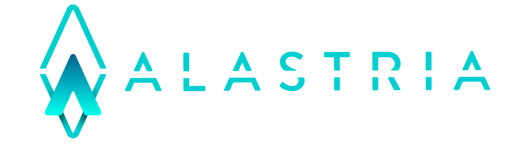

<table>
  <tr>
   <td>
      
   </td>
  </tr>
</table>

# Alastria General information

Alastria is a non-profit association that promotes the digital economy through the development of decentralised ledger technologies/Blockchain.

Alastria is an association open to all types of companies and organizations, our mission is to reach all sectors and contribute to the creation of an innovation ecosystem as diverse as possible.

We have a clear vocation to be a pioneering project of reference in the generation of new digital economy models.

## Do you want to know about the Association?
Please, visit our [Web Page](https://alastria.io) to find all the information about the work we are doing in the Association.

## Do you want to know about Technology and our collaborative way of working?
Please go to [Wiki](https://github.com/alastria/Alastria/wiki) to find all the documentation about the Technical Axis of Alastria.

Do not hesitate to contact us. We will be happy to assist you in [support@alastria.io](mailto:support@alastria.io)

